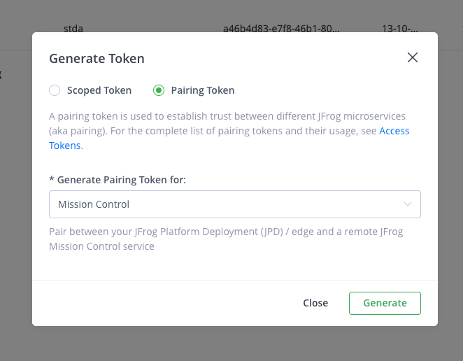
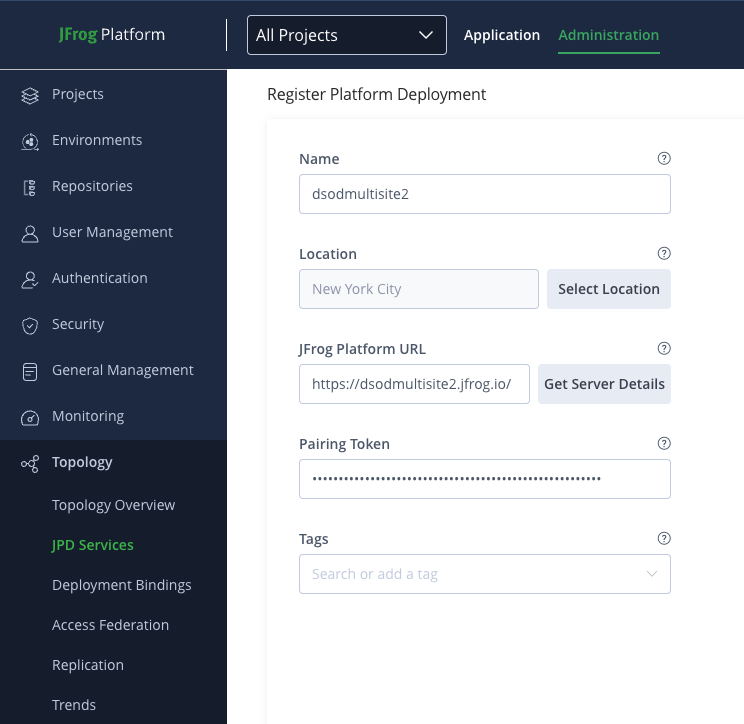
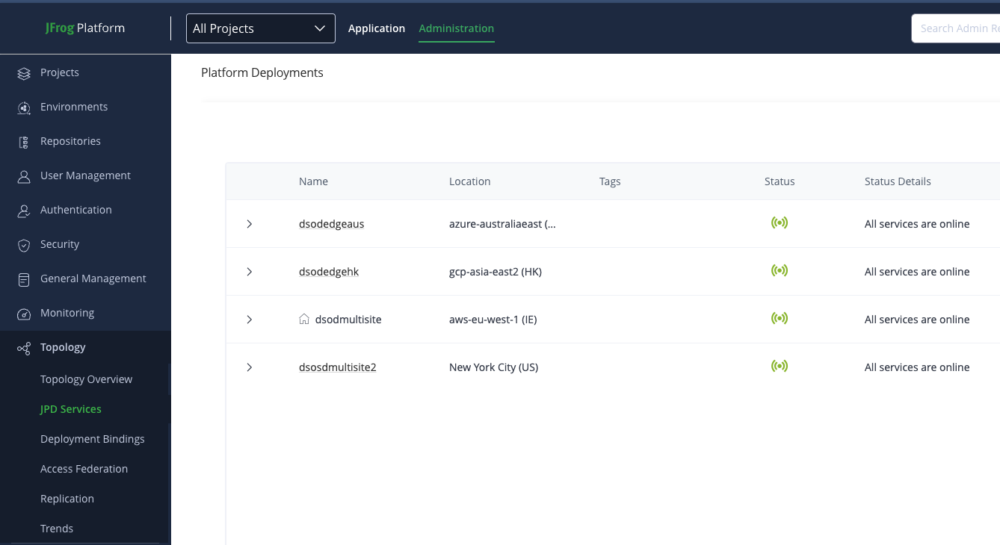
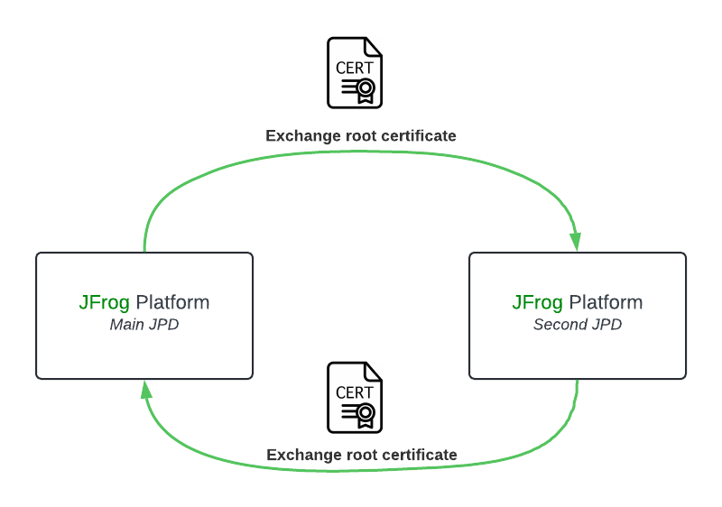
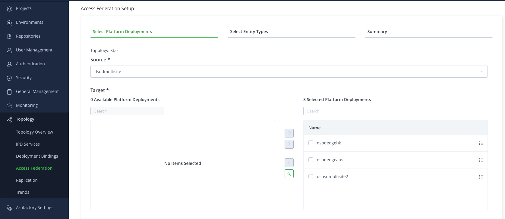
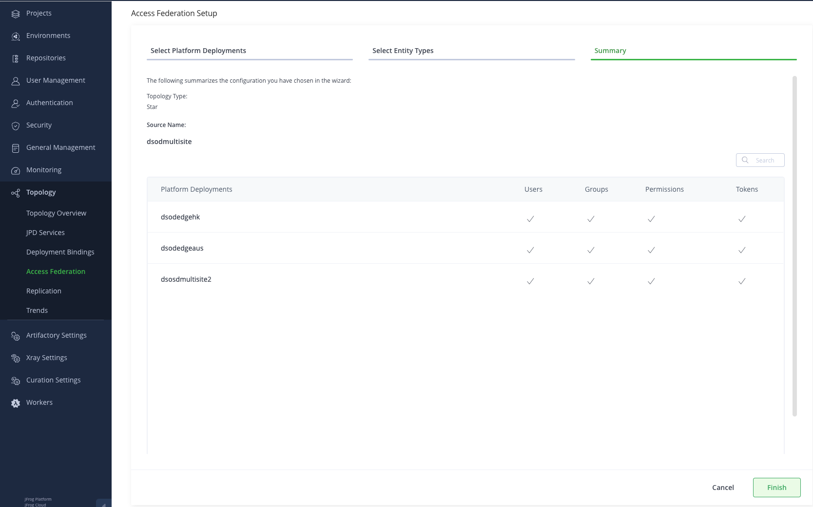
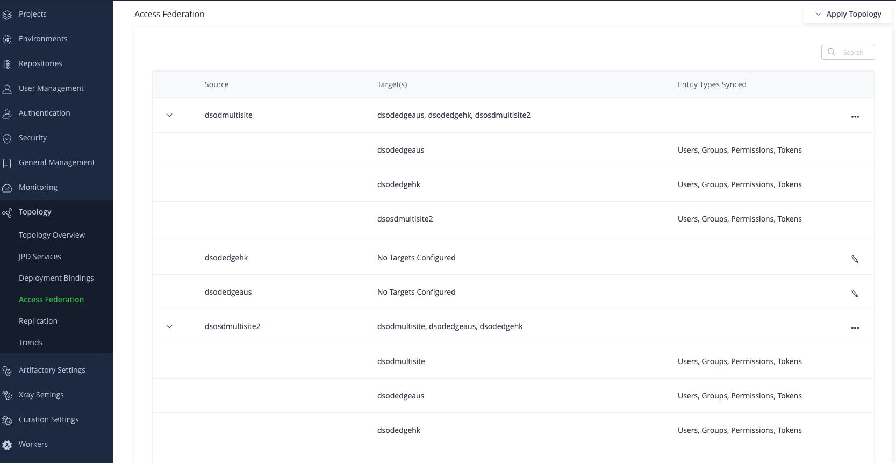

# LAB 0 - Federate JFrog Platform Deployment

The aim of this lab is to federate platforms (JFrog Platform Deployment and Edge nodes) with the main JFrog platform and set up Access Federation. 

This lab is a pre-requisite to Lab1 and Lab2 where you will actually use:

- Federated repositories
- Push / Pull replication
- Release Lifecycle Management with promotion and distribution

## Register new platform deployment

You can manage, monitor and gain visibility on all your install JFrog Platform Deployment (JPD) and the installed services by register from within a central Dashboard in the platform. 

To pair two JPDs, the system relies on **paring token**. This is an access token used for the initial paring flow.

### Paring steps

On The second JPD:

1. From the **Administration module**, click on **User Management** then **Access Tokens**.
2. Generate a **Paring token** for Mission Control
   
3. Keep the generated token to register this JPD with the main one (This token is available for 5 minutes).

On the main JPD:

1. From the **Administration module**, click on **Topology** then **JPD Services** 
2. Register new JPD by clicking on **New Platform Deployment**
3. Fill in the required fields including the **Paring token** previously generated

4. Check JPD health status

Once the new platform has been registered, you can view a lists of registered Platform Deployments with their related installed services including Artifact, Xray, Distribution.   This view is only available in the HOME JPD where Mission Control was activated. 

These steps can be reproduced to pair Edge nodes.

## Federate access between all federated services

Access Federation give you control over access to all, or any subset of your services from one location by synchronizing all security entities (users, groups, permissions and access tokens) between the federated services

Pre-requisites steps (already done for this lab):

- Enable Mission control on the main JPD
- Establish the Circle of Trust : Synchronization of security entities require a trust being established by providing the Access to the target Platform Deployment with the source Platform Deployments' root certificate. 

To exchange the certificate, you need to copy a service's root certificate to another service's

### Configuration steps

1. From the **Administration module**, click on **Topology** then **Access Federation**. 
2. Apply a **Start topology** with the main JPD as source and all other platforms as target

3. Apply the federation on all entities (Users, Groups, Permissions)

4. Repeat these steps to apply a **Start topology** with the second JPD as source
5. Once you applied start topology for both JDP, you can review the configuration on the UI

# Congratulations ! You have completed Lab 0

