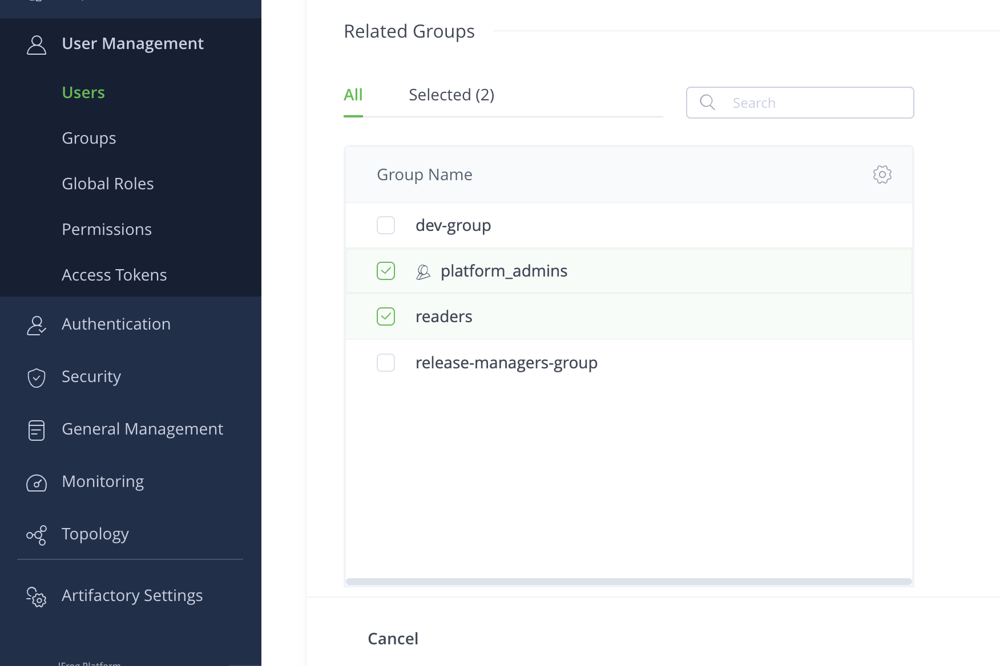
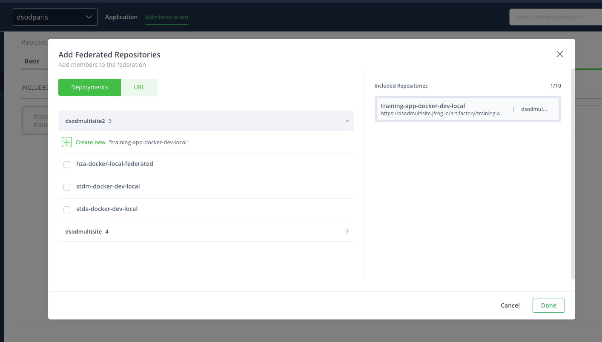
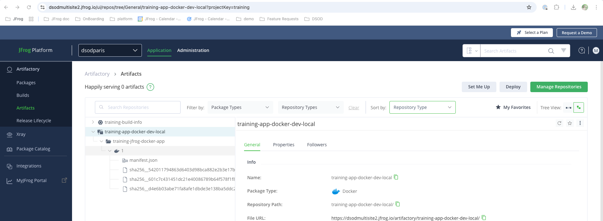
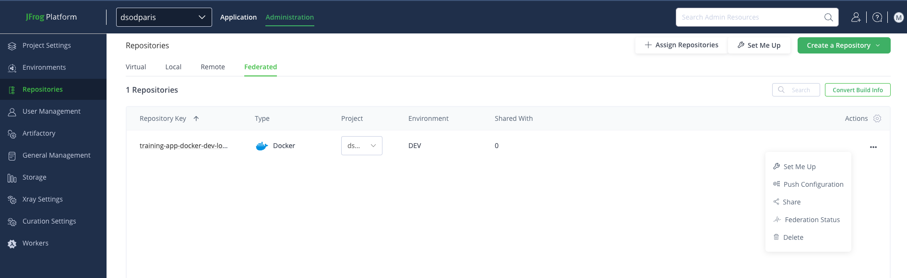
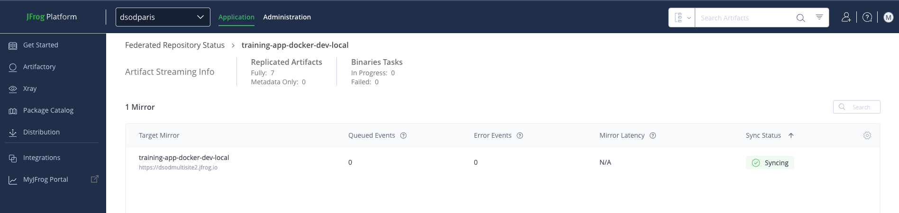

# LAB 1 - Access Federation and Federated Repositories

The aim of this lab is to understand the value of **Access Federation** and **Federated Repositories** in a context of distributed DevOps. 

## Lab Architecture

This lab is composed of:

- Main JPD platform (with Mission Control enabled) in Ireland (https://dsodmultisite.jfrog.io/)
- Second JPD in N. Virginia (https://dsodmultisite2.jfrog.io/)
- Artifactory Edge node in Hong Kong (https://dsodedgehk.jfrog.io/)
- Artifactory Edge node in Australia (https://dsodedgeaus.jfrog.io/)

All these resources are part of the same circle of trust and access are federated between them (users, groups and tokens).

As a student, you have a dedicated JFrog project where you will find a bunch of repositories that has been created for you. To select your JFrog project, please use the panel as follows.

To retrieve information about your project (especially the project key), you can click on **Project Settings** from **Administration** module

To access the topology of the platform and the access federation configuration, put yourself in **All Projects** also called **default project**

## Access Federation

In this section, you will create a user in the main JPD and check that it is synchronized with the second JPD and edge nodes.

Log in the [main platform](https://dsodmultisite.jfrog.io/) with your credentials and select the **All Projects** project

1. From the **Administration module**, click on Users then create a new user
2. Fill required fields with relevant data and save (you can assign the user to the platform_admins group)

3. Use the newly created user to log in [second JPD](https://dsodmultisite2.jfrog.io/), [HK edge node](ttps://dsodedgehk.jfrog.io/) or / and [Aus Edge node](https://dsodedgeaus.jfrog.io/)

4. You are now logged in the other platform. You may have read only access if you didn't provide permission during the user creation. 

You can repeat these steps and create Users, Groups and Access token in one platform and check that it is replicated everywhere. You can also delete your own resources.

## Federated Repositories

In this section, you will create a federated repository and monitor the synchronisation between the source and destinations

Use the **main** JPD and select your **student** project

1. Find the docker repository <PROJECT_KEY>-app-docker-dev-local
2. Convert this repository to **Federated** using the UI or via [JFrog CLI](#convert-local-repository-to-a-federated-repository)

3. Edit the repository configuration and add repositories in the **Federation** tab

4. Choose the *dsosmultisite2* platform and select and select **Create new**. This will create the federated repository in the second JPD automatically. 

5. Validate changes and save

6. Check that on the [second JPD]((https://dsodmultisite2.jfrog.io/) your repository has been created with the right configuration (If you created it automatically)

You can now upload artifacts in both federated repositories and check that they are replicated seamlessly.

To upload an artifact without using the JFrog CLI or Docker client, you can copy an artifact from the **shared-docker-dev-local** to your federated repository. Not that this repository is in the **default** project on the [main JPD](https://dsodmultisite.jfrog.io/).
1. **Copy** artifact from the shared repository via the UI or via [JFrog CLI](#copying-files). 

*Please don't move artifacts since they are shared with all students*

2. Then select your federated repository

3. Then, check on the second JPD that your artifact is replicated

4. On the main JPD, uou can also review the federation status on the repository

5. You can try to remove an artifact and note that this artifact is removed from all federated repositories.

### Going further

Although artifacts are synchronized, you can also try to update the configuration of the repository and check whether or no it is replicated. 

Based on the network performance and size of the artifact, synchronising it in a far location can be long. You can check if it is possible to download it during the synchronisation period.

# Congratulations ! You have completed Lab 1

## JFrog CLI

### Convert local repository to a federated repository

Run :

    jf rt curl -XPOST "/api/federation/migrate/<PROJECT_KEY>-app-docker-dev-local" -H "Content-Type: application/json"

[JFrog documentation](https://jfrog.com/help/r/jfrog-rest-apis/convert-local-repository-to-a-federated-repository)

### Copying files

    jf rt cp shared-docker-dev-local/ubuntu/ <PROJECT_KEY>-app-docker-dev-local/ubuntu/

