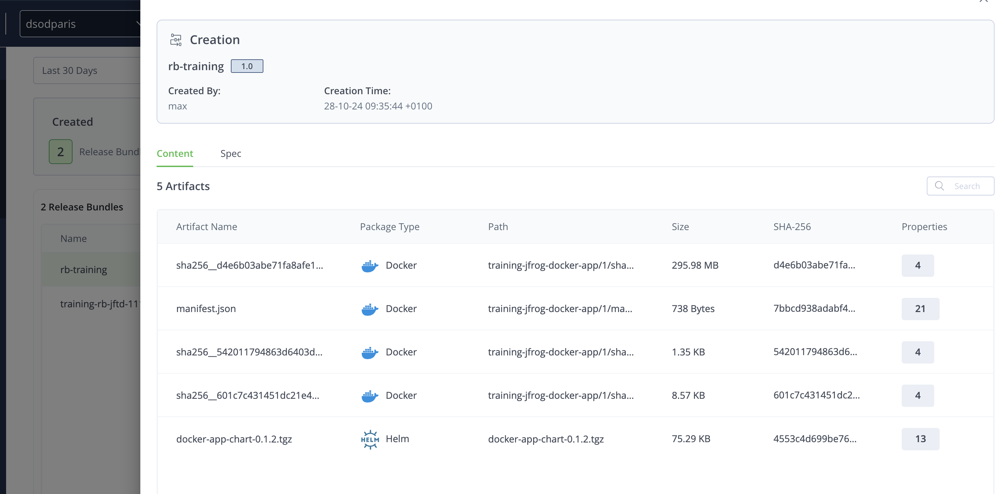
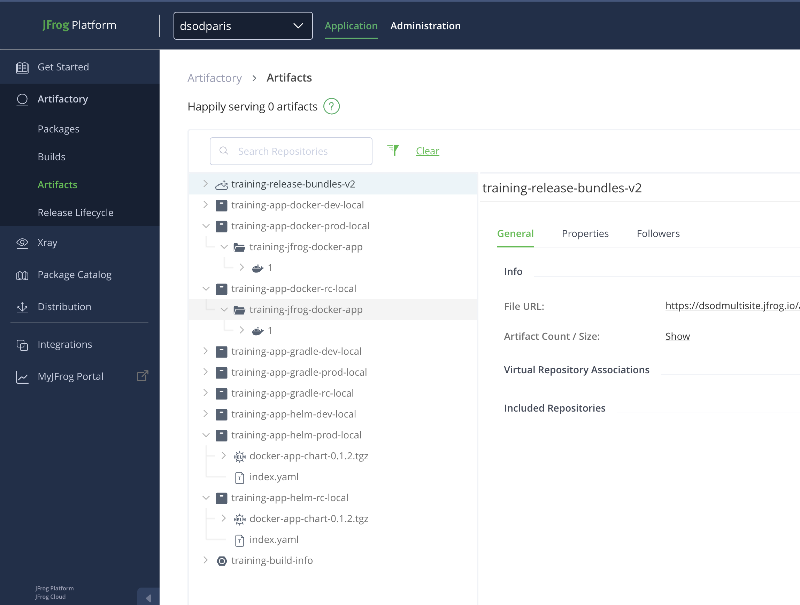
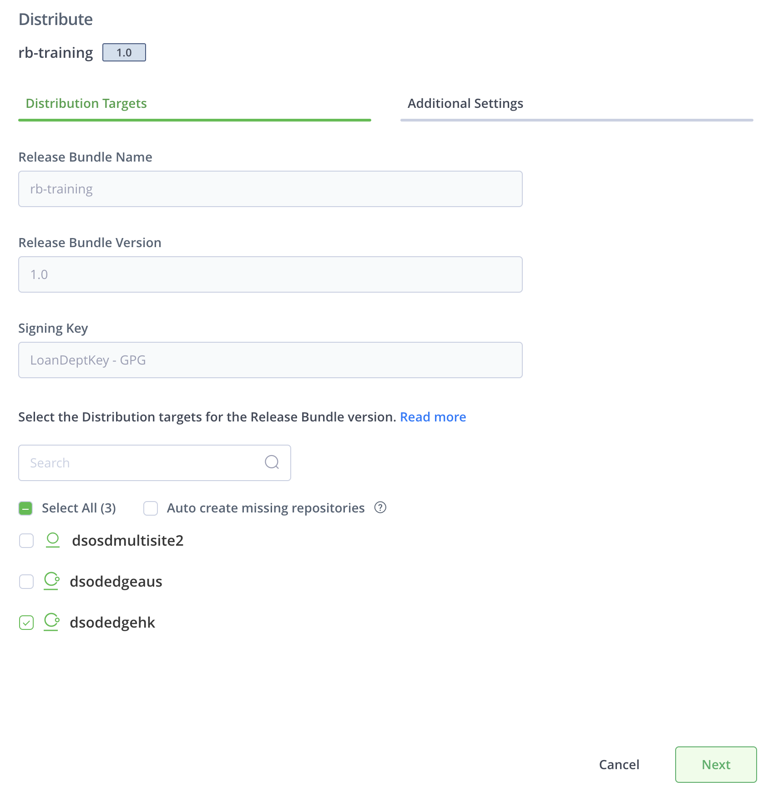
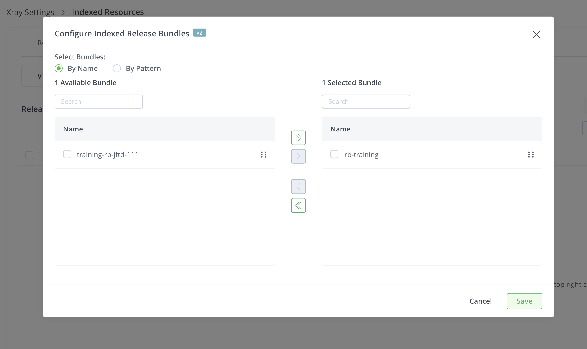
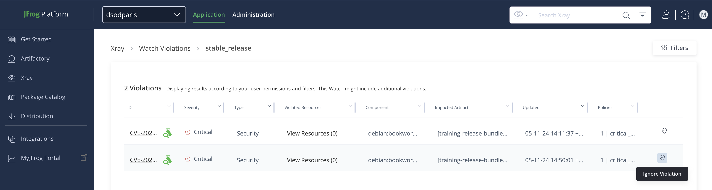
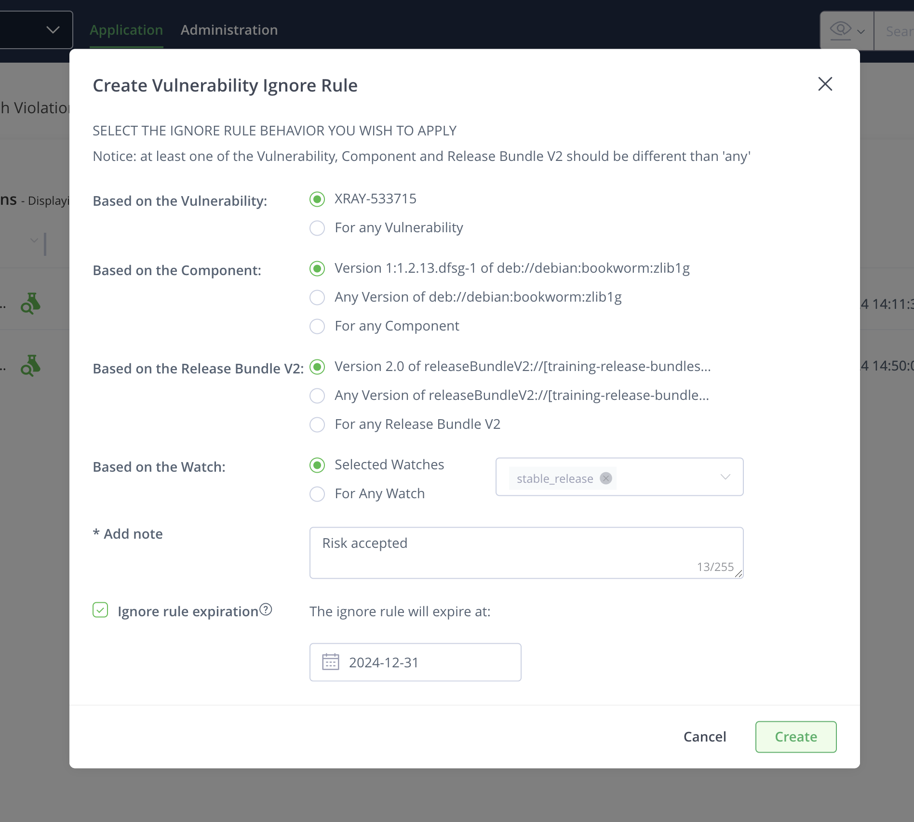

# LAB 2 - Release Lifecycle Management and Distribution

The aim of this lab is to understand the value of using JFrog Release Lifecycle Management and Distribution in the context of distributed DevOps. 

## Lab Architecture

This lab is composed of:

- Main JPD platform (with Mission Control enabled) in Ireland (https://dsodmultisite.jfrog.io/)
- Second JPD in N. Virginia (https://dsodmultisite2.jfrog.io/)
- Artifactory Edge node in Hong Kong (https://dsodedgehk.jfrog.io/)
- Artifactory Edge node in Australia (https://dsodedgeaus.jfrog.io/)

All these resources are part of the same circle of trust and access are federated between them (users, groups and tokens).

For this lab, you will use the following resources (already created):

Virtual repositories:
- <PROJECT_KEY>-app-docker-virtual
- <PROJECT_KEY>-app-gradle-virtual
- <PROJECT_KEY>-app-helm-virtual

Local repositories:
- <PROJECT_KEY>-app-docker-dev-local
- <PROJECT_KEY>-app-docker-rc-local
- <PROJECT_KEY>-app-docker-prod-local
- <PROJECT_KEY>-app-gradle-dev-local
- <PROJECT_KEY>-app-gradle-rc-local
- <PROJECT_KEY>-app-gradle-prod-local
- <PROJECT_KEY>-app-helm-dev-local
- <PROJECT_KEY>-app-helm-rc-local
- <PROJECT_KEY>-app-helm-prod-local

Remote repositories
- <PROJECT_KEY>-app-docker-remote
- <PROJECT_KEY>-app-gradle-remote
- <PROJECT_KEY>-app-helm-remote

One build-info repository with 3 builds (on per package type) and one release-bundle-v2 

## Release lifecycle management

In this section, we are going to create a release bundle from à build-info. 

1. From the **Application** module, select **Artifactory** then **Release Lifecycle**
2. Create a new Release Bundle from **builds**

3. Enter a release bundle name with a version. To sign your bundle, use the *LoanDeptKey* GPG key.

4. In the builds selection part, add the following builds
   
- training-helm-jfd-112 - 1
- training-docker-jfd-112 - 1

**Do not include dependencies at this stage.**

5. Your release bundle has been created. If you click on the release bundle version then *create* event, you can see the content of this release

6. Close this window and come back to the release bundle version. You can now drag and drop the release bundle version from **NEW** environment to **DEV** environment.

7. You are about to promote your release bundle in the dev environment. Click on next then you will see the target repository for the promotion. Finaly promote your release bundle

8. You are successfully promoted your bundle to the development environment. You can now do the same steps to promote it to **RC** then **PROD**

9. [Optional] You can check after a promotion that artifacts have been copied to the RC and PROD local repository

10. Come back to your release bundle and click on the latest version created. You can see the timeline with all evidences (promotion, distribution etc...)
11. Your artifact is ready for production and distribution. Click on **Actions** then **distribute**

11. Select the edge where you want to distribute your release bundle (You can optionally create the repository if it does not exist on the Edge node. In this lab, all repositories already exist).

12. Click on *Next* then *Distribute*
13. Add a Path Mappings to distribute release bundle to PROD repositories in your destination

14. You should now see that your distribution is in progress then distributed

14. [Optional] You can review all evidences related to a release bundle 
15. Check on the edge node you selected that your artifact has been distributed. 

### Going further

As you may see, release bundle are integrated with JFrog Xray. You can consult Xray scan data, from **Application** module, select **Xray** then **Scan list** and find your release bundle.

By using **Watches** and **Policies**, you are able to take actions once a policy is violated. These actions can be:

- Block release bundle promotion
- Block release bundle distribution

In this section, we will check how Xray can secure your release bundle from being promoted and distributed if some thresholds are met.

1. First, we need to index your newly created release bundle in Xray. From **Administration** module, click to **Xray settings** then **Indexed Resources** and Add a Release bundle

2. Choose your release bundle

3. Update the Xray policy and enable *Block release bundle promotion* and *Block release bundle distribution*. From **Application** module, click on **Watches & Policies** then **critical_severity** policy and edit it. 

4. Save the rule
5. Create a new release bundle and promote it or distribute a release bundle to a new destination

6. In case you want to distribute your bundle, you can ignore the violation that prevent the release bundle from being distributed. From **Application** module, click on **Xray** then **Watch Violations**

7. Select the watch **stable_release** then ignore the violation

8. Fill the form with all relevant information

9. Finally, you can try to promote / distribute your release bundle again. It should work

# Congratulations ! You have completed Lab

## API commands