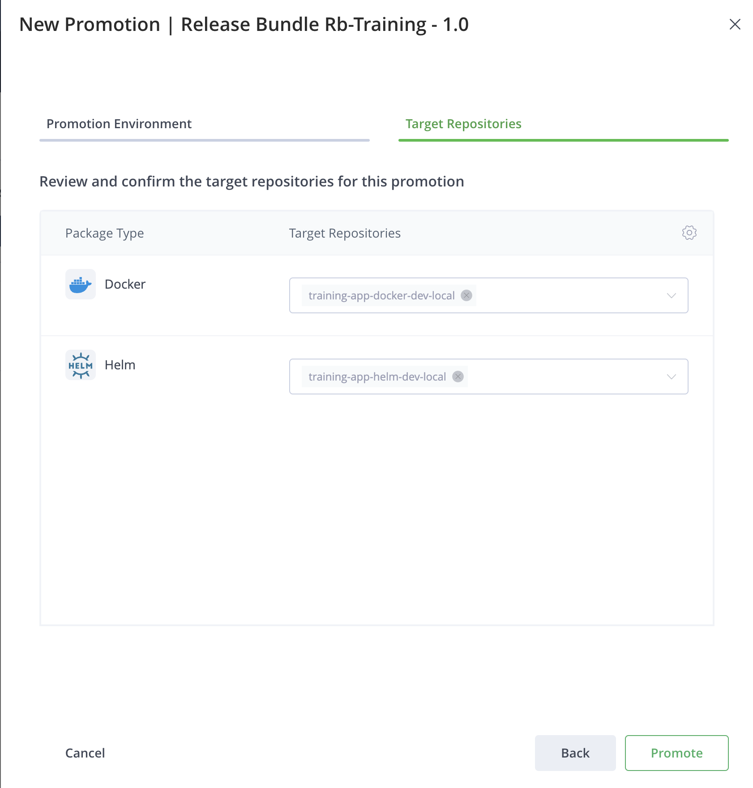
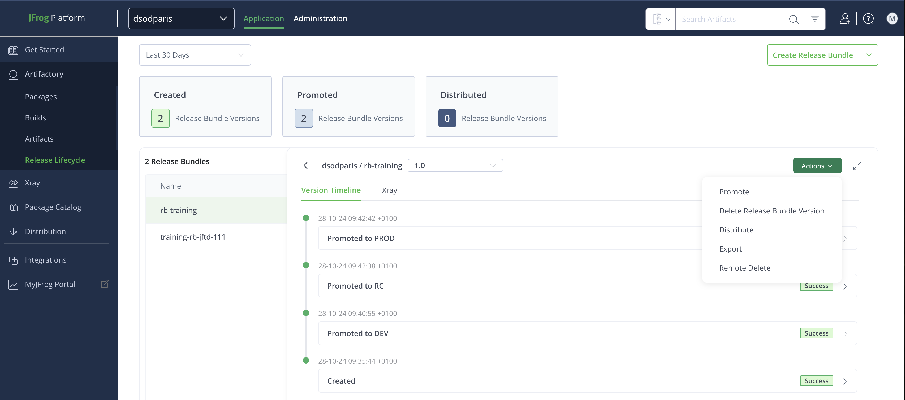

# LAB 2 - Release Lifecycle Management and Distribution

The aim of this lab is to understand the value of using JFrog Release Lifecycle Management and Distribution in the context of distributed DevOps. 

## Lab Architecture

This lab is composed of:

- Main JPD platform (with Mission Control enabled) in Ireland (https://dsodmultisite.jfrog.io/)
- Second JPD in N. Virginia (https://dsodmultisite2.jfrog.io/)
- Artifactory Edge node in Hong Kong (https://dsodedgehk.jfrog.io/)
- Artifactory Edge node in Australia (https://dsodedgeaus.jfrog.io/)

All these resources are part of the same circle of trust and access are federated between them (users, groups and tokens).

For this lab, you will use the following resources:

All resources have been created for you. The purpose of this lab is to promote and distribute a docker image with the helm chart to deploy the application. The docker image contains a gradle application. 

## Release lifecycle management

In this section, we are going to create a release bundle from à build-info. 

Use your **student** project for instructions below

1. From the **Application** module, select **Artifactory** then **Release Lifecycle**
2. Create a new Release Bundle from **builds** via UI or using [JFrog CLI](#create-release-bundle)

3. Enter a release bundle name with a version. To sign your bundle, use the *LoanDeptKey* GPG key.

4. In the builds selection part, add the following builds
   
- training-helm-jfd-112 - 1
- training-docker-jfd-112 - 1

**Do not include dependencies at this stage.**

5. Your release bundle has been created. If you click on the **release bundle version** then *created* event, you can see the content of this release

6. Close this window and come back to the release bundle version. You can now drag and drop the release bundle version from **NEW** environment to **DEV** environment or using [JFrog CLI](#promote-release-bundle)

7. You are about to promote your release bundle in the dev environment. Click on next then you will see the target repository for the promotion. Finally promote your release bundle

8. You are successfully promoted your bundle to the development environment. You can now do the same steps to promote it to **RC** then **PROD**

9. [Optional] You can check after a promotion that artifacts have been copied to the RC and PROD local repository

10. Come back to your release bundle and click on the latest version created. You can see the timeline with all evidences (promotion, distribution etc...)

11. Your artifact is ready for production and distribution. Click on **Actions** then **distribute**

12. Select the edge where you want to distribute your release bundle (You can optionally create the repository if it does not exist on the Edge node. In this lab, all repositories already exist).

13. Click on *Next* then *Distribute*

14. Add a Path Mappings to distribute release bundle to PROD repositories in your destination

    # Path mappings
    Inputs :                                    Outputs : 
    <PROJECT_KEY>-app-docker-dev-local/(.*)     <PROJECT_KEY>-app-docker-prod-local/$1
    <PROJECT_KEY>-app-helm-dev-local/(.*)       <PROJECT_KEY>-app-helm-prod-local/$1

15. You should now see that your distribution is in progress then distributed

16. [Optional] You can review all evidences related to a release bundle 

17. Check on the edge node you selected that your artifact has been distributed. 

18. [Optional] You can try to delete your distributed release bundle in your edge using **remote delete** using UI or [JFrog CLI](#remote-delete)

### Going further

In this section, we will check how Xray can secure your release bundle from being promoted and distributed if some thresholds are met.

As you may see, release bundle are integrated with JFrog Xray. You can consult Xray scan data, from **Application** module, select **Xray**, **Scan list** then **release bundle**  find your release bundle.

By using **Watches** and **Policies**, you are able to take actions once a policy is violated. These actions can be:

- Block release bundle promotion
- Block release bundle distribution

In this section, we will check how Xray can secure your release bundle from being promoted and distributed if some thresholds are met.

1. First, we will update the Xray Policy to block the promotion and the distribution if the release bundle contains a critical cve. From the **Application** module, select **Xray**, **Watches & Policies** the **Policies**. Update the Xray policy named **<PROJECT_KEY>_critical_severity**

2. Click on **Next** then enable *Block release bundle promotion* and *Block release bundle distribution* 

3. Save the rule and the policy

4. Create a new release bundle. You can create it from builds like you did earlier or create it from a previous release bundle as follows

5. Promote or distribute the release bundle. The promotion / distribution must be blocked because the release bundle contains a critical violation

6. In case you want to distribute your bundle even if a watch violation prevent the promotion / distribution, you can accept the risk and ignore it. From **Application** module, click on **Xray** then **Watch Violations**

7. Select the watch **<PROJECT_KEY>_stable_release** then ignore the violation. Be careful to select the right version of your release bundle.

8. Fill the form with all relevant information. You can decide to set an expiration to the ignore rule. Then **create** the ignore rule

You can see in the Policy violation section that your violation status is now **Ignored**

9. Finally, you can try to promote / distribute your release bundle again. It should work

# Congratulations ! You have completed Lab 2

## JFrog CLI

### Create release bundle

    # Update create_spec file with your project key (ex: Student A -> stda)
    jf rbc --spec=./create_spec.json --signing-key=LoanDeptKey --sync=true --project=<PROJECT_KEY> <PROJECT_KEY>-rb-training 1.0

### Promote release bundle

    jf rbp --signing-key=LoanDeptKey --project=<PROJECT_KEY> <PROJECT_KEY>-rb-training 1.0 [DEV|RC|PROD]

### Distribute release bundle 

    To be checked : it is possible to add multiple mapping pattern with the JFrog CLI ?

    # Update dist-rules json file with the name of the destination (dsodedgehk, dsodedgeaus)
    jf rbd --dist-rule=dist-rules.json --project=<PROJECT_KEY> --mapping-pattern="training-app-docker-dev-local/(.*)" --mapping-target="training-app-docker-prod-local/$1" <PROJECT_KEY>-rb-training 1.0 --sync

### Remote delete

    # Update dist-rules json file with the name of the destination (dsodedgehk, dsodedgeaus)
    jf rbdelr -dist-rule=dist-rules.json --project=<PROJECT_KEY> --quiet --sync <PROJECT_KEY>-rb-training 1.0
    