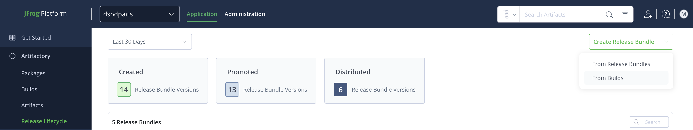
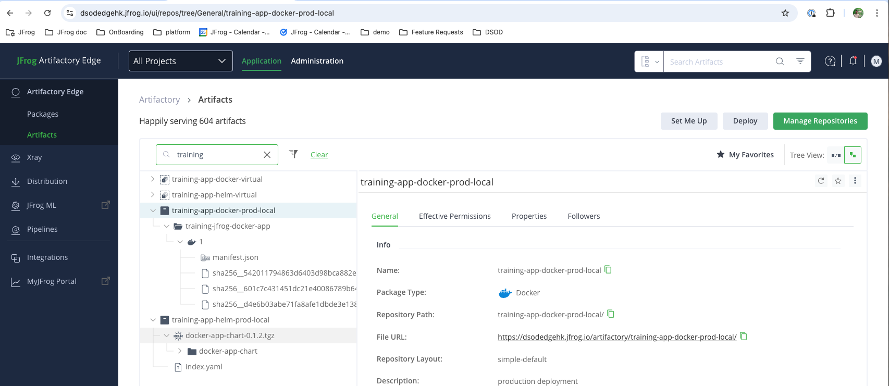

# LAB 2 - Release Lifecycle Management and Distribution

The aim of this lab is to ...

## Lab Architecture

This lab is composed of:

- Main JPD platform (with Mission Control enabled) in Ireland (https://dsodmultisite.jfrog.io/)
- Second JPD in N. Virginia (https://dsodmultisite2.jfrog.io/)
- Artifactory Edge node in Hong Kong (https://dsodedgehk.jfrog.io/)
- Artifactory Edge node in Australia (https://dsodedgeaus.jfrog.io/)

All these resources are part of the same circle of trust and access are federated between them (users, groups and tokens).

For this lab, you will use the following resources (already created):

- <PROJECT_KEY>-maven-dev-local maven repository
- <PROJECT_KEY>-maven-stg-local maven repository
- <PROJECT_KEY>-maven-prod-local maven repository
- <PROJECT_KEY>-maven-remote-prod maven repository
- <PROJECT_KEY>-maven-build build-info

## Release lifecycle management

In this section, we are going to create a release bundle from à build-info. 

1. From the **Application** module, select **Builds** then *<PROJECT_KEY>-maven-build*. 

2. Choose the build ID *1* and then create a release bundle from it (You can optionally browse the build info to understand its value). 

3. Enter a name and version for your release. Select the *LoadDeptKey* as signing key and press Next

4. You can see all artifact that will be included in the release bundle. **Do not include dependencies for now** and press Create

5. Your release bundle has been created. If you click on the release bundle version then *create* event, you can see the content of this release

6. Close this window and come back to the release bundle version. You can now drag and drop the release bundle version from **NEW** environment to **DEV** environment.

7. You are about to promote your release bundle in the dev environment. Click on next then you will see the target repository for the promotion. Finaly promote your release bundle

8. You are successfully promoted your bundle to the development environment. You can now do the same steps to promote it to **STG** then **PROD**

9. [Optional] You can check after a promotion that artifacts have been copied to the STG and PROD local repository

10. Come back to your release bundle and click on the latest version created. Your artifact is ready for production and distribution. Click on **Actions** then **distribute**

11. Select the edge where you want to distribute your release bundle (You can optionally create the repository if it does not exist on the Edge node).

12. Click on *Next* then *Distribute*
13. You should now see that your distribution is in progress then distributed

14. [Optional] You can review all evidences related to a release bundle 
15. Check on the edge node you selected that your artifact has been distributed. 

**Note**:  
As you can see, there is no JFrog project on the Edge nodes. In additional, the repository which has been created automatically is not the production repository but dev one. This is a limitation of the feature "Auto create missing repositories"

### Going further

Watch & Policy with "Block promotion" and "Block distribution" ?